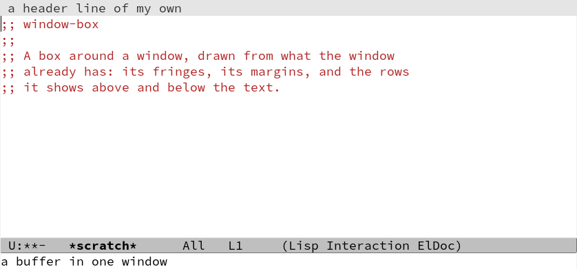
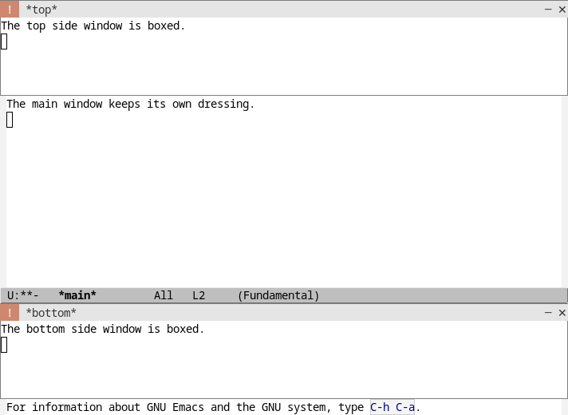
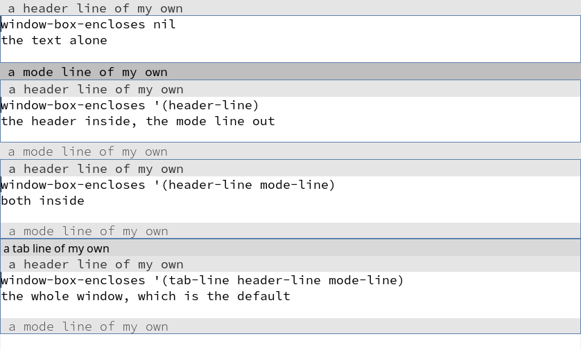
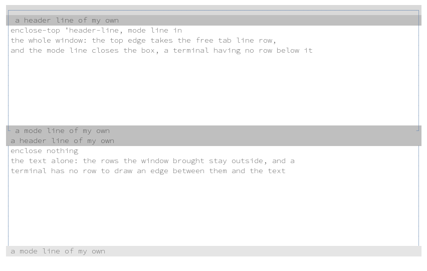
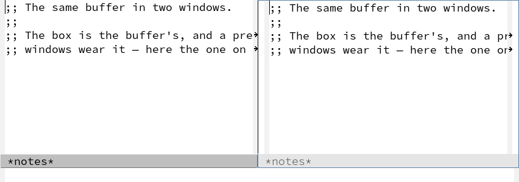

# Inspired by: https://github.com/othneildrew/Best-README-Template
#+OPTIONS: toc:nil

[[https://github.com/MArpogaus/window-box/graphs/contributors][https://img.shields.io/github/contributors/MArpogaus/window-box.svg?style=flat-square]]
[[https://github.com/MArpogaus/window-box/network/members][https://img.shields.io/github/forks/MArpogaus/window-box.svg?style=flat-square]]
[[https://github.com/MArpogaus/window-box/stargazers][https://img.shields.io/github/stars/MArpogaus/window-box.svg?style=flat-square]]
[[https://github.com/MArpogaus/window-box/issues][https://img.shields.io/github/issues/MArpogaus/window-box.svg?style=flat-square]]
[[https://github.com/MArpogaus/window-box/blob/main/COPYING][https://img.shields.io/github/license/MArpogaus/window-box.svg?style=flat-square]]
[[https://github.com/MArpogaus/window-box/actions/workflows/test.yml][https://img.shields.io/github/actions/workflow/status/MArpogaus/window-box/test.yml.svg?branch=main&label=tests&style=flat-square]]
[[https://linkedin.com/in/MArpogaus][https://img.shields.io/badge/-LinkedIn-black.svg?style=flat-square&logo=linkedin&colorB=555]]

* window-box :TOC_3_gh:noexport:
  - [[#about-the-project][About The Project]]
  - [[#what-the-box-encloses][What the Box Encloses]]
  - [[#getting-started][Getting Started]]
  - [[#customization][Customization]]
  - [[#in-the-terminal][In the Terminal]]
  - [[#known-limits][Known Limits]]
  - [[#comparison-with-buffer-box][Comparison with buffer-box]]
  - [[#how-it-works][How It Works]]
  - [[#contributions][Contributions]]
  - [[#license][License]]
  - [[#contact][Contact]]

** About The Project

=window-box-mode= draws a box around each window that shows the
buffer.  The sides sit at the window's very edge: on a graphic
display one pixel at the outermost edge of each fringe, in a terminal
a character in the outermost column of each margin.  The horizontal
edges are drawn on the rows the window has.

The mode keeps the width of the fringes, so their indicators stay
where you can read them, and it asks for its own columns of margin
beside whatever the buffer keeps there: magit's log holds its dates in
a wide right margin, =diff-hl-margin-mode= marks changed lines on the
left, and both keep their columns inside the box.  The mode does not change what
your header line and your mode line show, and =window-box-padding=
buys air between the box and the text.

The picture below shows two side windows with a box.  The main
window keeps its own dressing.

** What the Box Encloses

A window is a stack of rows.  From top to bottom these rows are the
tab line, the header line, the text and the mode line.

The inside of the box is one unbroken stack of rows around the text.
Two options say where it starts and where it ends:
=window-box-enclose-top= names the topmost row inside — =tab-line=
encloses the tab line and the header line, =header-line= the header
line alone, nil the text alone — and =window-box-enclose-mode-line=
says whether the mode line is inside.  The default encloses the whole
window.

A row you name that the window does not show appears: the box writes
its own edge there, so the box closes with its own line rather than
borrowing another row's.

Both displays follow the options, and a terminal has one limit: it
draws with characters, and a character needs a row.  Where the options
leave a row outside the box and the window keeps no row free, a
terminal has nothing to draw the boundary with and the box is open on
that side.  Enclose that row and it closes.

#+begin_src emacs-lisp
  ;; the whole window, which is the default
  (setq window-box-enclose-top 'tab-line
        window-box-enclose-mode-line t)

  ;; the text alone
  (setq window-box-enclose-top nil
        window-box-enclose-mode-line nil)

  ;; the header line inside, the mode line outside
  (setq window-box-enclose-top 'header-line
        window-box-enclose-mode-line nil)
#+end_src

Set the options buffer-locally to give each buffer its own box.

The picture shows four windows with one setting each.  The box has a
color here, because a color makes the edges easy to find.

A terminal draws the box with characters, and a character needs a
row:

The top edge uses the tab line row while the window does not show
tabs.  There is no row below the mode line.  The last row inside the
box therefore shows the two corners and closes the box.

** Getting Started

Install the package.  Then turn the mode on in the buffers you want
to box:

#+begin_src emacs-lisp
  (use-package window-box
    :ensure t)

  ;; for example: a box around each help buffer
  (add-hook 'help-mode-hook #'window-box-mode)
#+end_src

The package works well together with [[https://github.com/MArpogaus/auto-side-windows][auto-side-windows]].  Box the
buffers that go into a side window, and the frame reads as a set of
panels.

#+begin_src emacs-lisp
  (add-hook 'auto-side-windows-after-display-hook
            (lambda (buffer &rest _)
              (with-current-buffer buffer (window-box-mode 1))))

  ;; The mode belongs to the buffer.  Emacs can show one buffer in a
  ;; panel and in a usual window at the same time.  A box usually
  ;; belongs to the place:
  (setq window-box-window-predicate
        (lambda (window) (window-parameter window 'window-side)))
#+end_src

The picture below shows one buffer in two windows.  Only one of the
two windows has a box.

** Customization

The package has few options:

| Option                        | Meaning                                              |
|-------------------------------+------------------------------------------------------|
| =window-box=                  | the face of the box; its foreground is the color     |
| =window-box-color=            | one color for the box, buffer-local if you set it so |
| =window-box-enclose-top=      | the topmost row inside the box                       |
| =window-box-enclose-mode-line= | whether the mode line is inside                     |
| =window-box-padding=          | columns between a side and the text                  |
| =window-box-radius=           | corner radius in pixels, zero for right angles       |
| =window-box-characters=       | the characters of the box in a terminal              |
| =window-box-window-predicate= | the windows of a boxed buffer that get a box         |

The box is one pixel on every side.  The horizontal edges are one
pixel because an overline cannot be thicker.  A side is a periodic
fringe bitmap, one pixel wide, which repeats over every line's full
height — an ordinary text line, a banner drawn from images, a formula
preview.  A character's ink height is the font's business and a
margin image is one line tall, so neither survives every buffer; the
bitmap does, and there is no option for the look of the sides.

Round the corners — pixels on a graphic display, ╭ ╮ ╰ ╯ in a
terminal.  Every row the box puts its ends on bends: its own edge rows,
and your tab line, header line or mode line where the box takes one of
them in:

#+begin_src emacs-lisp
  (setopt window-box-radius 8)
#+end_src

Give a buffer more air:

#+begin_src emacs-lisp
  (setq-local window-box-padding 2)
#+end_src

Give one buffer its own color:

#+begin_src emacs-lisp
  (setq-local window-box-color "orange")
  (window-box-mode 1)
#+end_src

Use round corners in a terminal:

#+begin_src emacs-lisp
  (setq window-box-characters "╭╮╰╯│─")
#+end_src

** In the Terminal

The box is made of characters, so it also works in =emacs -nw=.

#+begin_example
  ┌──────────────────────────────────────────────┐
  │boxed in the terminal                         │
  │second line                                   │
  └──────────────────────────────────────────────┘
#+end_example

A window can show a header line and a mode line.  The box then draws
its top edge in the tab line row.  The mode line shows the two lower
corners and closes the box.

#+begin_example
  ┌──────────────────────────────────────────────┐
  │ a header line of my own                      │
  │boxed around its own rows                     │
  │                                              │
  └ a mode line of my own                        ┘
#+end_example

=make tty= runs Emacs in a pseudo terminal.  It reads the screen back
through [[https://github.com/selectel/pyte][pyte]] and fails if an edge does not close.

** Known Limits

- On a graphic display the sides live in the fringes, and a fringe
  shows one bitmap per line: a line whose fringe shows an indicator
  of its own shows that instead of the side.  Give such indicators a
  home in the margins instead, where the box frames them —
  [[file:docs/implementation.org][docs/implementation.org]] has the settings for magit, flymake and
  diff-hl.
- A terminal draws the sides in one column of margin per side, and
  asks for that column beside the buffer's own: the side is drawn
  before what the buffer puts in the margin, so it sits outside it on
  the left.  In the right margin the order is the same, so a buffer's
  own content there — magit's dates — sits outside the box's side
  rather than inside it.
- While the box is up, its sides outrank a prefix a line brings of
  its own — a shell's indent gutter waits under the box and comes
  back with it gone.
- In a terminal an edge needs a row of its own, and a window has only
  so many rows.  The top edge uses the tab line row if the window
  shows no tabs.  There is no row below the mode line.  The box has
  no edge where it must go between two rows, for example below a
  header line that stays outside.  A graphic display draws each
  setting.
- A row inside the box shows the edges of the box at its two ends.  A
  row that fills its full width loses the last column to the edge.
- On a graphic display Emacs draws its own border in the first pixel
  column of a window that has a neighbour on its left.  This border
  covers the side of the box there.  A line is there in each case,
  but it has the color of the frame and not the color of the box.
- A window that shows its own tab line keeps it.  In a terminal the
  tabs use the row of the top edge.  The box then has three edges,
  and the tab line closes it at the top.
- A scroll bar is outside the margin, and the right side of the box
  is then inside the scroll bar.  Turn the scroll bar off for a clean
  box.
- An edge on a row takes one pixel from the height of that row.  The
  text moves down by one pixel when the box appears.
- The sides are drawn along the lines of the buffer, so a window whose
  buffer is empty gets the horizontal edges and no sides.

** Comparison with buffer-box

The package follows the idea of Nicolas Rougier's [[https://github.com/rougier/buffer-box][buffer-box]], which
draws its borders from the tab line, the margins and the mode line.
There are four differences:

- buffer-box replaces the header line and the mode line with its own.
  window-box keeps what they show.
- buffer-box draws the side edges with overlays, which stop at the
  end of the text.  window-box uses the =line-prefix= of the buffer,
  which reaches the rows below the last line of text as well.
- buffer-box sets the fringes of the frame to zero, and gives advice
  to =set-window-margins= and =set-window-fringes=.  window-box
  changes nothing global.
- buffer-box has border styles and a header line with many parts.
  window-box draws a box.

** How It Works

[[file:docs/implementation.org][docs/implementation.org]] describes how the package draws the box.  It
names the parts of the window dressing that the box uses, tells how
the box gives them back, and lists what the tests measure.

** Contributions

Contributions are greatly appreciated!  Feel free to check the
[[https://github.com/MArpogaus/window-box/issues][issues page]] or submit a [[https://github.com/MArpogaus/window-box/pulls][pull request]].

** License

Distributed under the [[file:COPYING][GPLv3]] License.

** Contact

[[https://github.com/MArpogaus/][Marcel Arpogaus]] - [[mailto:znepry.necbtnhf@tznvy.pbz][znepry.necbtnhf@tznvy.pbz]] (encrypted with [[https://rot13.com/][ROT13]])

Project Link: [[https://github.com/MArpogaus/window-box][https://github.com/MArpogaus/window-box]]
